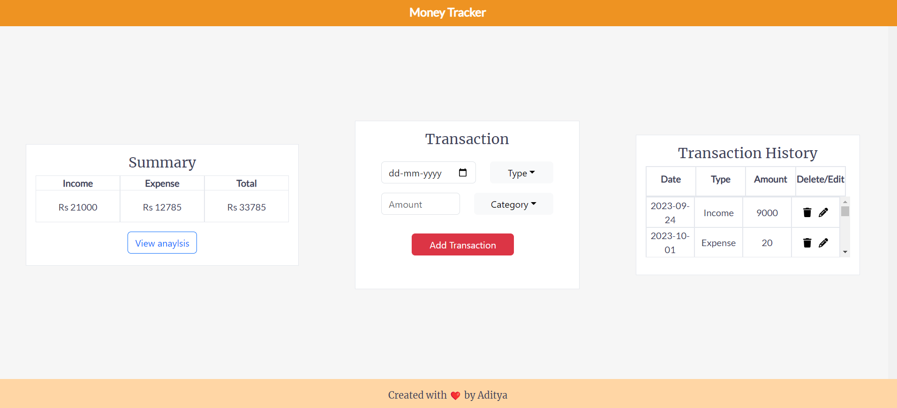
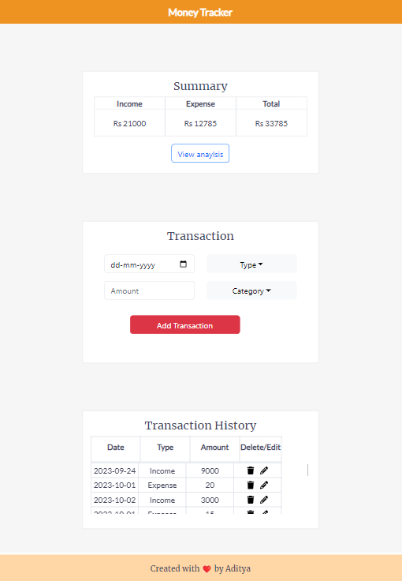
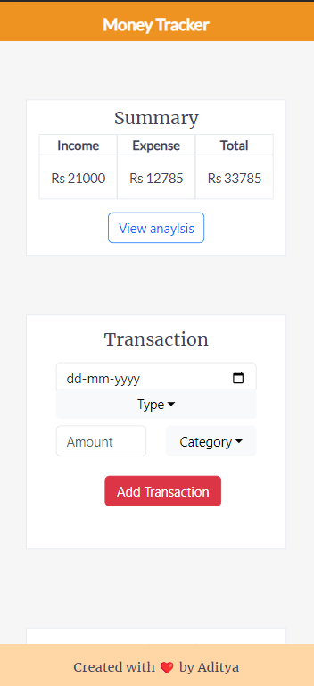
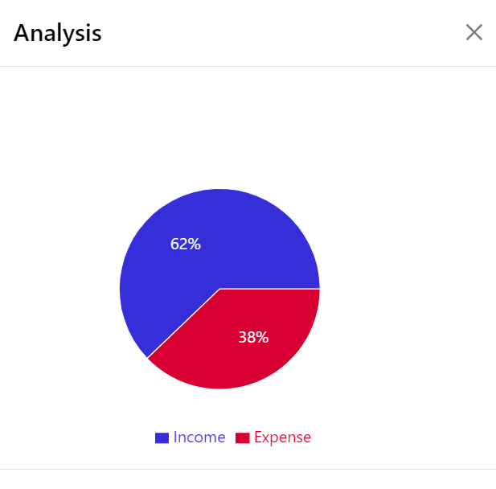

# Money Tracker

Money tracker is a web application where you can track our spendings and earnings. The app is simple to use and has all the features which will help you to manage your money.

## Features

⭐ Add transaction.\
⭐ Edit transaction.\
⭐ Delete transaction.\
⭐ View previous transactions.\
⭐ View analytics of your transactions.

## Technologies

📌 React with TypeScript(Frontend).\
📌 NodeJS with express and mysql.\
📌 Recharts for visualization of data.\
📌 React bootstrap for styling.

## Screenshots

Home page

 

 
 

Tablet/Ipad view

 

 
 

Mobile view

 

 
 

Analytics modal

